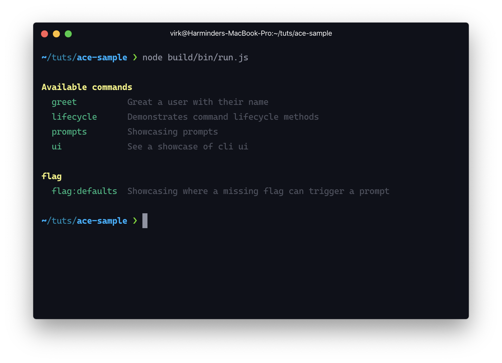
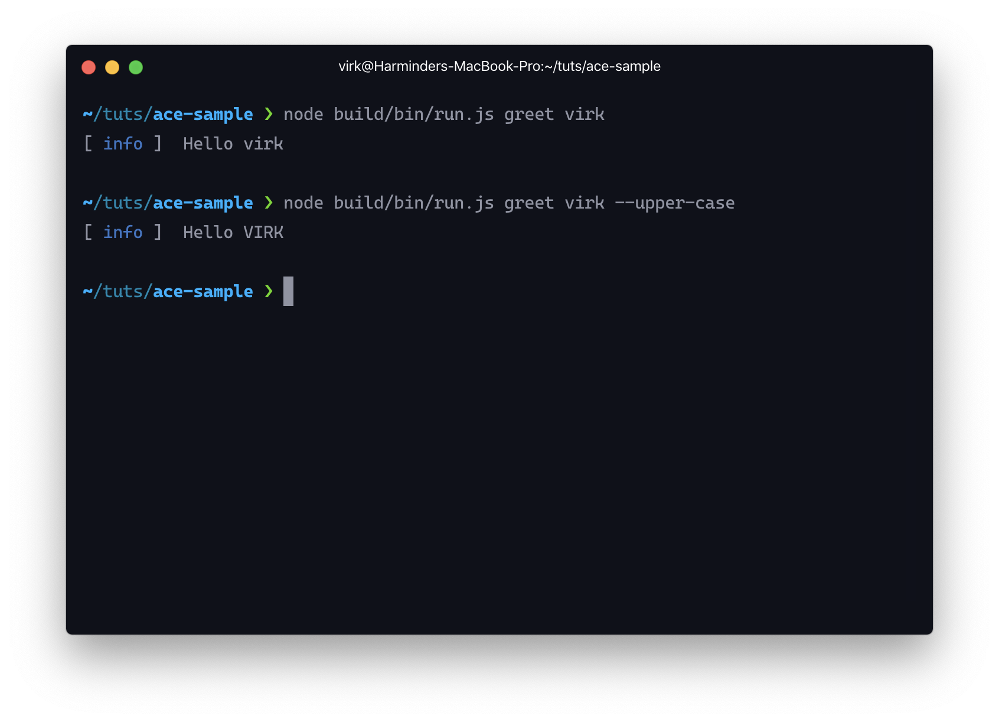
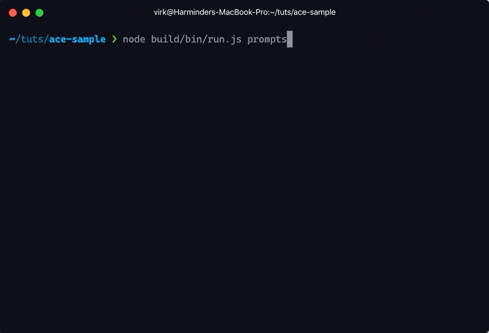

# Ace standalone CLI

> A sample project to demonstrate usage of AdonisJS ace to create a standalone CLI app

## Usage

Begin by cloning the repo

```sh
git clone https://github.com/thetutlage/ace-sample-project.git
```

Next, install all the required dependencies. Just make sure you are running `node >= 12.0.0`

```sh
npm install
```

Next, compile the Typescript source to Javascript by running the following command.

```sh
npm run build
```

And now you can interact with the CLI locally by running the `node build/bin/run.js` file



- The compiled javascript output is written to the `build` folder.
- `bin/run.js` file is the entry point of the command line app
- Running this file without any arguments displays the help screen using a default command.

The commands I have added showcase some of the inbuilt features of ace. You can try running them

### `node build/bin/run.js greet`



### `node build/bin/run.js prompts`



### Development

Since the source code is in Typescript, it needs to be compiled down to Javascript before you can run it.

This can be painful during development and hence I created an npm script inside the `package.json` file to run the Typescript source code directly.

During development, you can run the same set of commands by running `npm run dev <command-name>`

### Publishing via npm

You would want others to use your command line by installing it globally and then running some binary. Let's call this binary `myapp` for now.

To begin with, we need to tell npm about our binary/command-line app name and the Javascript file we want to map to it.

This is done inside the `package.json` file.

```json
{
  "bin": {
    "myapp": "./build/bin/run.js"
  }
}
```

Let's give this a try right now. Run the following command.

```sh
npm run build && npm link
```

The `npm link` command will create a symlink of the package inside the globally installed `node_modules` directory.

Now you can run the same set of commands using the binary name instead.

```sh
myapp greet
myapp prompts
myapp ui
```

## How its configured?

### About commands

- The commands are stored inside the `commands` directory.
- Every command is an ES6 class extending the ace `BaseCommand`.
- The `run` method on the command is executed to run the command.
- The command can define its arguments and flags using Typescript decorators.

### About entrypoint

The command-line needs to have an entry-point. A common convention is to use the `bin` directory for command line entry points. So I decided to go with the `bin/run.ts` file.

- The file imports the `Kernel` class from ace.
- The Kernel class alone is responsible for handling the complete lifecycle of running the commands.
- The `kernel.register` method accepts an array of commands to register. There are other ways too, but this is the simplest one to get started.

## Ace features

Following is the list of ace features

- Pre-bundled [ui library](https://github.com/poppinss/cliui) to display **tables**, **log messages**, **render tasks** and a lot more
- Pre-bundled [prompts libary](https://github.com/poppinss/prompts) to render different style of prompts.
- Lightweight API for creating files using stubs.
- Support for command-specific accepting arguments and flags
- Support for global flags. For example: `--help` flag to display help. Check `bin/run.ts` for example.
- Properly handles the lifecycle of commands and make sure the process exists with correct exit codes.
- Inbuilt helpers for display errors
- Inbuilt helpers for rendering commands help on the terminal
- Allows hooking into the lifecycle of commands using `find` and `run` hooks.

## Upcoming improvements

Currently ace relies on the `@adonisjs/application` package that is very specific to AdonisJS. Removing this dependency needs changes at a couple of places, but I never bothered doing it, since I know it is mostly used within AdonisJS apps.

## Opinionated UI

Ace is somewhat opinionated with its UI layer, as I don't want to create something that is infinitely configurable. Items like the logger, tables, prompts, and tasks UI don't allow many customizations.

## Closing notes

There are a handful of other ways to improve the entry file flow and speed up things. But right now I want to keep it simple so that you can play with it.

If this is of any interest, here's the [Ace flow chart](https://mermaid-js.github.io/mermaid-live-editor/#/view/eyJjb2RlIjoiZ3JhcGggVERcbiAgQXtLZXJuZWwuaGFuZGxlfSBcbiAgQSAtLT4gQihaZXJvIGFyZ3MpXG4gIEEgLS0-IEMoT25seSBmbGFncyBkZWZpbmVkKVxuICBBIC0tPiBEKEFyZ3MgZGVmaW5lZClcbiAgQiAtLT4gRShFeGVjdXRlIGJlZm9yZSBmaW5kIGhvb2spXG4gIEUgLS0-IEUxKEV4ZWN1dGUgYWZ0ZXIgZmluZCBob29rKVxuICBFMSAtLT4gRTIoRXhlY3V0ZSBiZWZvcmUgcnVuIGhvb2spXG4gIEUyIC0tPiBFMyhSdW4gZGVmYXVsdCBjb21tYW5kKVxuICBFMyAtLT4gRTQoRXhlY3V0ZSBhZnRlciBydW4gaG9vaylcbiAgRTQgLS0-IFExXG4gIEMgLS0-IEYoSXRlcmF0ZSB0aHJvdWdoIGdsb2JhbCBmbGFncylcbiAgRiAtLT4gUTFcbiAgUTF7RW5kfVxuICBRMSAtLT4gUTIoSGFzIGVycm9ycylcbiAgUTIgLS0-IFEzKEV4aXQgd2l0aCBjb2RlIDEpXG4gIFExIC0tPiBRNChObyBlcnJvcnMpXG4gIFE0IC0tPiBRNShFeGl0IHdpdGggY29kZSAwKVxuICBEIC0tPiBHKFJ1biBiZWZvcmUgZmluZCBob29rKVxuICBHIC0tPiBIe0ZpbmQgY29tbWFuZH1cbiAgSCAtLT4gSDEoQ29tbWFuZCBub3QgZm91bmQpXG4gIEgxIC0tPiBIMihFeGVjdXRlIGFmdGVyIGZpbmQgaG9vaylcbiAgSDIgLS0-IEgzKEl0ZXJhdGUgdGhyb3VnaCBnbG9iYWwgZmxhZ3MpXG4gIEgzIC0tPiBRMVxuICBIIC0tPiBJKENvbW1hbmQgZm91bmQpXG4gIEkgLS0-IEkxKEV4ZWN1dGUgYWZ0ZXIgZmluZCBob29rKVxuICBJMSAtLT4gSTIoSXRlcmF0ZSB0aHJvdWdoIGdsb2JhbCBmbGFncylcbiAgSTIgLS0-IEkze1ZhbGlkYXRlIGNvbW1hbmR9XG4gIEkzIC0tPiBKKFZhbGlkYXRpb24gZmFpbGVkKVxuICBKIC0tPiBKMShFeGl0IHdpdGggY29kZSAxKVxuICBJMyAtLT4gSyhWYWxpZGF0aW9uIHBhc3NlZClcbiAgSyAtLT4gSzEoRXhlY3V0ZSBiZWZvcmUgcnVuIGhvb2spXG4gIEsxIC0tPiBLMihSdW4gY29tbWFuZClcbiAgSzIgLS0-IEsze0NvbW1hbmQgdHlwZX1cbiAgSzMgLS0-IEwoTG9uZyBsaXZlZClcbiAgTCAtLT4gTDEoV2FpdCBmb3IgZXhwbGljaXQgY2FsbGVkIHRvIGtlcm5lbC5leGl0KVxuICBMMSAtLT4gTDIoRXhlY3V0ZSBhZnRlciBydW4gaG9vaylcbiAgTDIgLS0-IFExXG4gIEszIC0tPiBNKFNob3J0IGxpdmVkKVxuICBNIC0tPiBNMShFeGVjdXRlIGFmdGVyIHJ1biBob29rKVxuICBNMSAtLT4gUTFcbiAgXG5cblxuIiwibWVybWFpZCI6eyJ0aGVtZSI6ImRlZmF1bHQiLCJ0aGVtZVZhcmlhYmxlcyI6eyJiYWNrZ3JvdW5kIjoid2hpdGUiLCJwcmltYXJ5Q29sb3IiOiIjRUNFQ0ZGIiwic2Vjb25kYXJ5Q29sb3IiOiIjZmZmZmRlIiwidGVydGlhcnlDb2xvciI6ImhzbCg4MCwgMTAwJSwgOTYuMjc0NTA5ODAzOSUpIiwicHJpbWFyeUJvcmRlckNvbG9yIjoiaHNsKDI0MCwgNjAlLCA4Ni4yNzQ1MDk4MDM5JSkiLCJzZWNvbmRhcnlCb3JkZXJDb2xvciI6ImhzbCg2MCwgNjAlLCA4My41Mjk0MTE3NjQ3JSkiLCJ0ZXJ0aWFyeUJvcmRlckNvbG9yIjoiaHNsKDgwLCA2MCUsIDg2LjI3NDUwOTgwMzklKSIsInByaW1hcnlUZXh0Q29sb3IiOiIjMTMxMzAwIiwic2Vjb25kYXJ5VGV4dENvbG9yIjoiIzAwMDAyMSIsInRlcnRpYXJ5VGV4dENvbG9yIjoicmdiKDkuNTAwMDAwMDAwMSwgOS41MDAwMDAwMDAxLCA5LjUwMDAwMDAwMDEpIiwibGluZUNvbG9yIjoiIzMzMzMzMyIsInRleHRDb2xvciI6IiMzMzMiLCJtYWluQmtnIjoiI0VDRUNGRiIsInNlY29uZEJrZyI6IiNmZmZmZGUiLCJib3JkZXIxIjoiIzkzNzBEQiIsImJvcmRlcjIiOiIjYWFhYTMzIiwiYXJyb3doZWFkQ29sb3IiOiIjMzMzMzMzIiwiZm9udEZhbWlseSI6IlwidHJlYnVjaGV0IG1zXCIsIHZlcmRhbmEsIGFyaWFsIiwiZm9udFNpemUiOiIxNnB4IiwibGFiZWxCYWNrZ3JvdW5kIjoiI2U4ZThlOCIsIm5vZGVCa2ciOiIjRUNFQ0ZGIiwibm9kZUJvcmRlciI6IiM5MzcwREIiLCJjbHVzdGVyQmtnIjoiI2ZmZmZkZSIsImNsdXN0ZXJCb3JkZXIiOiIjYWFhYTMzIiwiZGVmYXVsdExpbmtDb2xvciI6IiMzMzMzMzMiLCJ0aXRsZUNvbG9yIjoiIzMzMyIsImVkZ2VMYWJlbEJhY2tncm91bmQiOiIjZThlOGU4IiwiYWN0b3JCb3JkZXIiOiJoc2woMjU5LjYyNjE2ODIyNDMsIDU5Ljc3NjUzNjMxMjglLCA4Ny45MDE5NjA3ODQzJSkiLCJhY3RvckJrZyI6IiNFQ0VDRkYiLCJhY3RvclRleHRDb2xvciI6ImJsYWNrIiwiYWN0b3JMaW5lQ29sb3IiOiJncmV5Iiwic2lnbmFsQ29sb3IiOiIjMzMzIiwic2lnbmFsVGV4dENvbG9yIjoiIzMzMyIsImxhYmVsQm94QmtnQ29sb3IiOiIjRUNFQ0ZGIiwibGFiZWxCb3hCb3JkZXJDb2xvciI6ImhzbCgyNTkuNjI2MTY4MjI0MywgNTkuNzc2NTM2MzEyOCUsIDg3LjkwMTk2MDc4NDMlKSIsImxhYmVsVGV4dENvbG9yIjoiYmxhY2siLCJsb29wVGV4dENvbG9yIjoiYmxhY2siLCJub3RlQm9yZGVyQ29sb3IiOiIjYWFhYTMzIiwibm90ZUJrZ0NvbG9yIjoiI2ZmZjVhZCIsIm5vdGVUZXh0Q29sb3IiOiJibGFjayIsImFjdGl2YXRpb25Cb3JkZXJDb2xvciI6IiM2NjYiLCJhY3RpdmF0aW9uQmtnQ29sb3IiOiIjZjRmNGY0Iiwic2VxdWVuY2VOdW1iZXJDb2xvciI6IndoaXRlIiwic2VjdGlvbkJrZ0NvbG9yIjoicmdiYSgxMDIsIDEwMiwgMjU1LCAwLjQ5KSIsImFsdFNlY3Rpb25Ca2dDb2xvciI6IndoaXRlIiwic2VjdGlvbkJrZ0NvbG9yMiI6IiNmZmY0MDAiLCJ0YXNrQm9yZGVyQ29sb3IiOiIjNTM0ZmJjIiwidGFza0JrZ0NvbG9yIjoiIzhhOTBkZCIsInRhc2tUZXh0TGlnaHRDb2xvciI6IndoaXRlIiwidGFza1RleHRDb2xvciI6IndoaXRlIiwidGFza1RleHREYXJrQ29sb3IiOiJibGFjayIsInRhc2tUZXh0T3V0c2lkZUNvbG9yIjoiYmxhY2siLCJ0YXNrVGV4dENsaWNrYWJsZUNvbG9yIjoiIzAwMzE2MyIsImFjdGl2ZVRhc2tCb3JkZXJDb2xvciI6IiM1MzRmYmMiLCJhY3RpdmVUYXNrQmtnQ29sb3IiOiIjYmZjN2ZmIiwiZ3JpZENvbG9yIjoibGlnaHRncmV5IiwiZG9uZVRhc2tCa2dDb2xvciI6ImxpZ2h0Z3JleSIsImRvbmVUYXNrQm9yZGVyQ29sb3IiOiJn).
